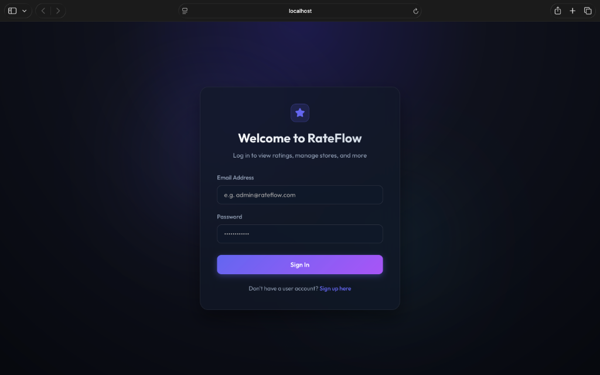
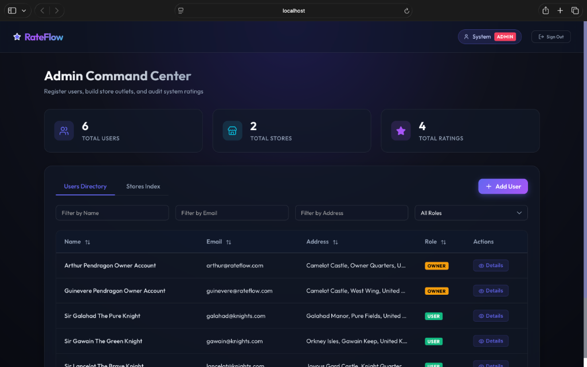

# RateFlow - Store Rating Application

RateFlow is a web application that allows users to register, search, and submit ratings (1 to 5 stars) for registered stores.

---

## App Interfaces

### Login Screen


### Administrator Command Center


---

## Tech Stack

*   **Backend**: Node.js, Express, TypeScript, Prisma ORM
*   **Database**: PostgreSQL
*   **Frontend**: React, Vite, TypeScript, Vanilla CSS (custom glassmorphic theme)
*   **Authentication**: JWT (JSON Web Tokens), bcryptjs

---

## Form Validation Rules

*   **Name**: Minimum 20 characters, maximum 60 characters.
*   **Address**: Maximum 400 characters.
*   **Password**: 8 to 16 characters. Must contain at least one uppercase letter and one special symbol (e.g. `!@#$%^&*`).
*   **Email**: Standard email format validation.

---

## Seed Accounts & Login Credentials

Use these seeded accounts to test different roles and dashboards:

| User Role | Email / Login ID | Password | Details / Assigned Outlet |
| :--- | :--- | :--- | :--- |
| **System Administrator** | `admin@rateflow.com` | `Password123!` | Manages user directory, store list, and system statistics |
| **Store Owner 1** | `arthur@rateflow.com` | `OwnerPassword1!` | Manages *The Roundtable Cafe and Bakery* |
| **Store Owner 2** | `guinevere@rateflow.com` | `OwnerPassword2!` | Manages *Merlins Magic Coffee and Donuts* |
| **Normal User 1** | `lancelot@knights.com` | `UserPassword1!` | Registered user who has rated both stores |
| **Normal User 2** | `galahad@knights.com` | `UserPassword2!` | Registered user who has rated *The Roundtable Cafe* |
| **Normal User 3** | `gawain@knights.com` | `UserPassword3!` | Registered user who has rated *Merlins Magic Coffee* |

---

## Local Development Setup

### 1. Database Configuration
1. Make sure a PostgreSQL service is running locally on port `5432`.
2. Create an empty database named `rateflow`:
   ```bash
   createdb rateflow
   ```

### 2. Backend Setup
1. Navigate to the backend directory:
   ```bash
   cd backend
   ```
2. Create a `.env` file based on your local PostgreSQL username:
   ```env
   PORT=5001
   DATABASE_URL="postgresql://<username>@localhost:5432/rateflow?schema=public"
   JWT_SECRET="super-secret-rateflow-key-2026"
   ```
3. Install dependencies:
   ```bash
   npm install
   ```
4. Run Prisma database migrations and generate the client:
   ```bash
   npx prisma migrate dev --name init
   ```
5. Seed the database with the test credentials and stores:
   ```bash
   npx prisma db seed
   ```
6. Start the Express development server:
   ```bash
   npm run dev
   ```
   *The backend will be listening on [http://localhost:5001](http://localhost:5001)*

### 3. Frontend Setup
1. Open a new terminal and navigate to the frontend directory:
   ```bash
   cd frontend
   ```
2. Install dependencies:
   ```bash
   npm install
   ```
3. Start the Vite React development server:
   ```bash
   npm run dev
   ```
   *The frontend will be available at [http://localhost:5173](http://localhost:5173)*

---

## Render Deployment Guide (Zero-Error Production Setup)

Follow these exact steps to deploy the application on Render so it functions durably without errors.

### Step 1: Create a PostgreSQL Database on Render
1. Log in to the Render Dashboard and click **New** ➔ **PostgreSQL**.
2. Configure settings:
    *   **Name**: `rateflow-db`
    *   **Database**: `rateflow`
    *   **User**: `rateflow_admin`
    *   **Region**: Select the region closest to you.
3. Choose the Free Tier and click **Create Database**.
4. Copy the **External Connection String**. It will look like:
   `postgres://rateflow_admin:密码@主机.oregon-postgres.render.com/rateflow`

---

### Step 2: Deploy the Backend API Web Service
1. In the Render Dashboard, click **New** ➔ **Web Service**.
2. Connect your Git repository.
3. Configure the following fields:
    *   **Name**: `rateflow-backend`
    *   **Root Directory**: `backend`
    *   **Language**: `Node`
    *   **Branch**: `main` (or your active branch)
    *   **Build Command**: `npm install && npm run build`
    *   **Start Command**: `npx prisma migrate deploy && node dist/index.js`
4. Add the following **Environment Variables**:
    *   `DATABASE_URL`: *Your Render PostgreSQL Connection String* (Paste the URL copied in Step 1. Ensure you append `?connection_limit=5` to prevent Render's Free Tier connection pool exhaust errors).
    *   `JWT_SECRET`: *A secure random secret key* (e.g. `rateflow-secure-jwt-key-2026-prod`)
    *   `PORT`: `5001`
5. Click **Deploy Web Service**.
6. **Important: Initial Database Seeding**
    *   Since the Start Command is `npx prisma migrate deploy && node dist/index.js` (which does not run the seed script to avoid database wipes on container restarts), the production database will start empty.
    *   To seed the test users and stores, wait for the build to finish.
    *   Go to your Web Service page on Render, click on the **Shell** tab in the sidebar.
    *   Run the seed command in the shell terminal:
        ```bash
        npx prisma db seed
        ```
    *   This populates the database once. The seed data is now saved permanently in your Render database.

---

### Step 3: Deploy the Frontend Static Site
1. In the Render Dashboard, click **New** ➔ **Static Site**.
2. Connect the same Git repository.
3. Configure the following fields:
    *   **Name**: `rateflow-frontend`
    *   **Root Directory**: `frontend`
    *   **Build Command**: `npm install && npm run build`
    *   **Publish Directory**: `dist`
4. Add the following **Environment Variables**:
    *   `VITE_API_BASE_URL`: *Your Render Backend Web Service URL with `/api` appended* (e.g. `https://rateflow-backend.onrender.com/api`).
5. **Set Up SPA Routing Rules (Crucial for Page Refresh Stability)**
    *   Vite React uses client-side routing. If a user refreshes the page on any path other than `/` (e.g., refreshing on a dashboard view), Render will return a `404 Not Found` error.
    *   To prevent this, go to your Static Site page on Render ➔ **Redirects/Rewrites** tab in the sidebar.
    *   Click **Add Rule** and enter:
        *   **Source Path**: `/*`
        *   **Destination Path**: `/index.html`
        *   **Action**: `Rewrite`
    *   Click **Save**.
6. Click **Deploy Static Site**.

Once both builds finish, navigate to your frontend URL. The application will run permanently and handle data updates without loss.
